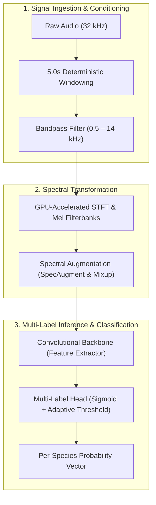

  <a class="action-btn btn-code" href="https://github.com/LuzuJ" target="_blank" rel="noopener">View Repositories (GitHub)</a>

## 1. Domain Constraints & Signal Challenges

Autonomous species monitoring from continuous soundscapes presents severe signal-processing constraints:
* **Unbalanced Signal-to-Noise Ratio (SNR):** Target vocalizations are frequently masked by tropical rainfall, wind buffeting against field microphones, and strident insect noise.
* **Polyphonic Soundscapes:** Multiple species call simultaneously in overlapping frequency bands, requiring a **strict multi-label classification** formulation rather than mutual exclusion.
* **Continuous Real-Time Ingestion:** Models must process audio streams with low latency without exceeding compute and power limits.

## 2. End-to-End Acoustic Processing Pipeline

### 2.1. Feature Extraction & Mel Filterbanks
* Raw audio signals (WAV/OGG) are standardized to a single-channel **32,000 Hz** sampling rate.
* Signals are cut into 5-second deterministic windows (160,000 samples).
* Short-Time Fourier Transform (STFT) with a 1024-point Hanning window and 512-point hop size transforms audio into 128 Mel-frequency bins on GPU.

### 2.2. Spectral Data Augmentation
To harden models against environmental shifts:
* **SpecAugment:** Masks horizontal frequency bands and vertical time slices, forcing representations to rely on distributed harmonic structures.
* **Acoustic Mixup:** Linearly blends audio waveforms with Beta-distributed weights:
$$\tilde{x} = \lambda x_i + (1 - \lambda) x_j, \quad \tilde{y} = \lambda y_i + (1 - \lambda) y_j$$

## 3. Knowledge Distillation & Edge Deployment

To deploy models onto solar-powered acoustic monitoring units:
1. **Master Ensemble:** Heavy convolutional ensembles trained with Binary Focal Loss to suppress false positives on background silence.
2. **Knowledge Distillation:** Compact student models (MobileNetV3 / ResNet-18) trained to match the ensemble's softened output logits via Kullback-Leibler divergence.
3. **Quantization:** INT8 post-training quantization shrinks model checkpoints to under 20 MB, delivering throughput exceeding 45 fps on CPU hardware.
