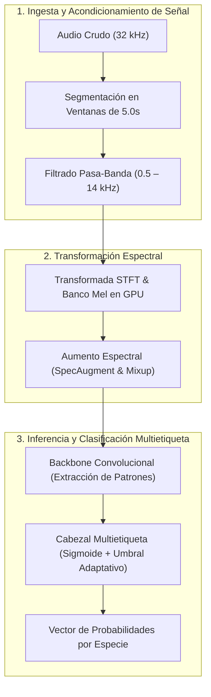

  <a class="action-btn btn-code" href="https://github.com/LuzuJ" target="_blank" rel="noopener">Ver Repositorios Kaggle (GitHub)</a>

## 1. Desafío Físico y Restricciones del Dominio

La identificación automatizada de especies de aves a partir de grabaciones de audio en campo continuo presenta desafíos singulares de procesamiento de señales:
* **Relación Señal/Ruido (SNR) desbalanceada:** Las vocalizaciones de interés suelen estar ocultas bajo lluvia torrencial, viento contra los micrófonos de campo, insectos estridentes y corrientes fluviales.
* **Solapamiento Polifónico:** Múltiples especies emiten vocalizaciones concurrentes en la misma banda de frecuencia, exigiendo una clasificación **multietiqueta estricta** (no multiclase mutuamente excluyente).
* **Restricción de Latencia e Inferencia Continua:** El modelo debe procesar horas ininterrumpidas de audio sin degradar el throughput computacional.

## 2. Pipeline de Procesamiento de Señales de Extremo a Extremo

### 2.1. Ingesta y Espectrogramas Mel
* El audio crudo en formato WAV/OGG se remuestrea a una frecuencia fija de **32,000 Hz**.
* Se generan segmentos de longitud temporal fija de **5.0 segundos** (160,000 muestras).
* Se aplica una Transformada Rápida de Fourier de Tiempo Reducido (STFT) con ventana Hanning de 1024 puntos y salto de 512 puntos, proyectando las energías hacia una escala Mel con 128 bancos de filtros normalizados en rango decibélico (dB).

### 2.2. Aumento de Datos Espectral
Para robustecer la red frente a variaciones de grabación y solapamiento:
* **SpecAugment:** Enmascaramiento estocástico de bloques temporales y bandas frecuenciales continuas, forzando a la red a no depender de armónicos aislados.
* **Mixup Acústico:** Combinación lineal en el dominio de la forma de onda de dos audios distintos con ponderaciones extraídas de una distribución Beta:
$$\tilde{x} = \lambda x_i + (1 - \lambda) x_j, \quad \tilde{y} = \lambda y_i + (1 - \lambda) y_j$$

## 3. Destilación y Despliegue en Borde (Edge)

Para viabilizar la ejecución en nodos acústicos alimentados por energía solar o microcontroladores embebidos:
1. **Entrenamiento de Ensamble Maestro:** Modelos de alta capacidad (EfficientNet-B3 y Audio Spectrogram Transformer) entrenados con función de pérdida focal binaria (*Binary Focal Loss*) para penalizar falsos positivos.
2. **Destilación de Conocimiento:** Se entrena un modelo estudiante ultraligero (MobileNetV3 / ResNet-18) minimizando la divergencia Kullback-Leibler frente a las salidas suavizadas (*soft labels*) del ensamble.
3. **Cuantización a FP16/INT8:** Reducción del tamaño de pesos a menos de 20 MB y ejecución a más de 45 cuadros por segundo en CPU estándar.
