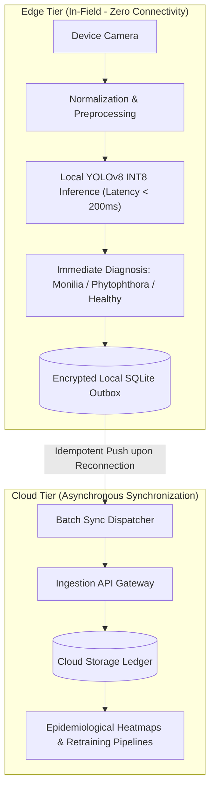

  <a class="action-btn btn-code" href="https://github.com/LynxCores" target="_blank" rel="noopener">Lynx Cores Org (GitHub)</a>
  <a class="action-btn btn-code" href="https://github.com/LuzuJ/Agro_RedConect" target="_blank" rel="noopener">Mobile App (GitHub)</a>

## 1. Real-World Constraints: Zero In-Field Connectivity

Agricultural cacao plantations across the coastal and Amazon regions of Ecuador operate under intermittent or non-existent cellular coverage. Architectures that rely on synchronous cloud API calls fail at the farmer's point of work.

**Lynx Cores / Vixora Tech** was engineered from first principles as an **Offline-First** system, awarded **2nd place at Hult Prize EPN** and advancing to the national finals based on technical feasibility and architecture rigor.

## 2. Two-Tier Topology: Decoupling Edge and Cloud

### 2.1. On-Device Inference (Edge AI)
* **Dataset Classes:** Target classes calibrated for cacao diseases: `0: Healthy`, `1: Monilia`, `2: Phytophthora`.
* **Model Optimization:** Conversion to ONNX format with 8-bit integer post-training quantization (**INT8**). The binary model footprint was reduced to under 15 MB, executing on mid-range Android processors in under 180 ms per frame without cellular service.

### 2.2. Idempotent Synchronization Protocol
* Diagnoses are recorded in an encrypted local SQLite Outbox database.
* When network connectivity is established, a background worker batches records with GPS telemetry and SHA-256 payload hashes.
* Cloud ingestion endpoints enforce hash-based idempotency to eliminate duplicate submissions during network retries.
