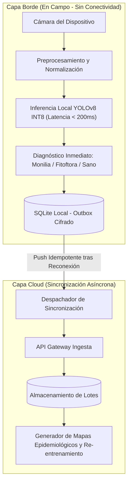

  <a class="action-btn btn-code" href="https://github.com/LynxCores" target="_blank" rel="noopener">Organización Lynx Cores (GitHub)</a>
  <a class="action-btn btn-code" href="https://github.com/LuzuJ/Agro_RedConect" target="_blank" rel="noopener">App Móvil (GitHub)</a>

## 1. Fricción del Mundo Real: Conectividad Cero en Campo

Las plantaciones agrícolas de cacao en la región litoral y amazónica ecuatoriana operan en zonas con cobertura celular nula o intermitente. Cualquier arquitectura que dependa de llamadas API sincrónicas a la nube para clasificar imágenes falla estrepitosamente en el punto de uso del agricultor.

**Lynx Cores / Vixora Tech** fue diseñado desde primeros principios como un sistema **Offline-First**, galardonado con el **2do lugar en Hult Prize EPN** y clasificado a la fase nacional por su rigor técnico y viabilidad arquitectónica.

## 2. Topología de Doble Capa: Borde Desacoplado de la Nube

### 2.1. Inferencia en el Borde (Edge AI)
* **Dataset y Clases:** Modelo entrenado sobre patologías críticas en cacao: `0: Sano`, `1: Monilia`, `2: Fitoftora`.
* **Optimización del Modelo:** Conversión de pesos a formato ONNX y posterior cuantización a precisión entera de 8 bits (**INT8**). Esto redujo el tamaño del binario del modelo a menos de 15 MB, permitiendo su ejecución local en procesadores móviles de gama media con latencia inferior a 180 ms por cuadro sin conexión.

### 2.2. Protocolo de Sincronización Cloud Idempotente
* Los registros generados en campo se encolan en una base de datos SQLite local utilizando el patrón **Outbox**.
* Cuando el sistema operativo reporta conectividad de red, un worker asíncrono empaqueta los diagnósticos junto con coordenadas GPS y hash criptográfico del payload, despachándolos hacia la API cloud.
* El endpoint de ingesta implementa verificación de idempotencia por hash para evitar duplicados en caso de reintentos sobre conexiones inestables.
