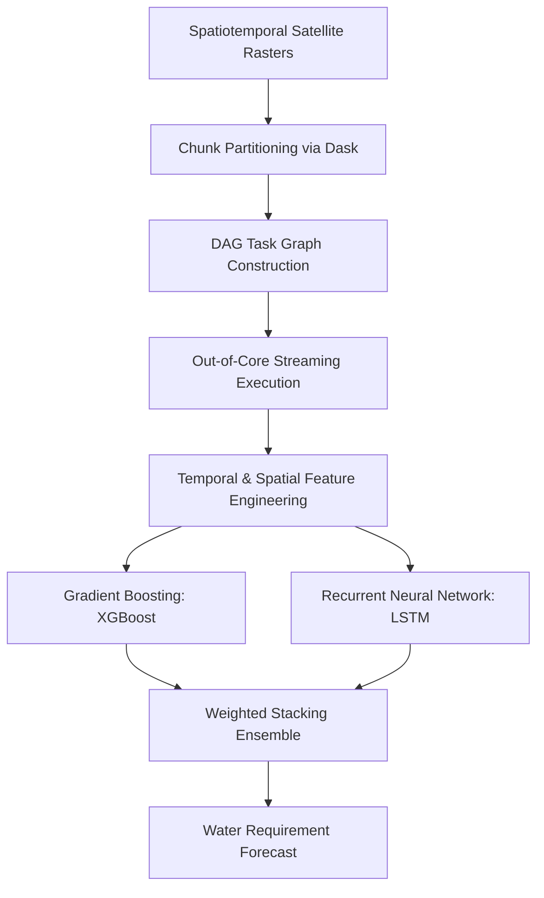

  <a class="action-btn btn-code" href="https://github.com/LuzuJ/Riego_Inteligente" target="_blank" rel="noopener">View Code (GitHub)</a>

## 1. Challenge: National-Scale Satellite Analytics

Forecasting soil water stress across hydrological basins requires ingesting massive spatiotemporal time series (NDVI, NDRE vegetation indices, land surface temperature, and precipitation rasters). Dataset sizes routinely exceed available server RAM, leading to Out-Of-Memory (OOM) crashes.

## 2. Compute Strategy: Out-of-Core Processing with Dask

Rather than provisioning oversized compute clusters for exploratory feature engineering, we utilized **Dask**:
* **Lazy Directed Acyclic Graphs (DAGs):** Matrix operations across partitioned arrays are scheduled lazily, materializing in memory only when explicitly evaluated by chunk.
* **Streaming Memory Management:** Each data chunk is read from disk, transformed, and released before loading subsequent blocks, bounding RAM utilization strictly below predefined hardware caps.

## 3. Hybrid Predictive Architecture

To model both instantaneous atmospheric non-linearities and historical hydrological lag:
1. **XGBoost:** Captures static soil characteristics and immediate meteorological anomalies with high feature gain interpretability.
2. **LSTM (Long Short-Term Memory):** Models 30-day temporal lag in soil thermal inertia and evapotranspiration.
3. **Ensemble:** Constrained Ridge meta-learner stacking predictions, outperforming baseline agricultural meteorological models in RMSE.
