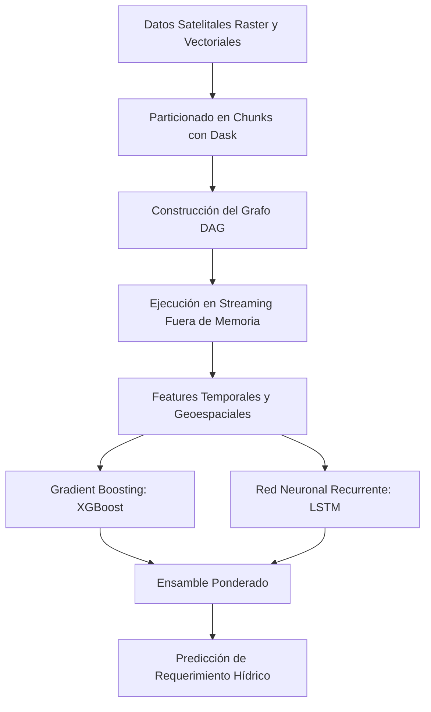

  <a class="action-btn btn-code" href="https://github.com/LuzuJ/Riego_Inteligente" target="_blank" rel="noopener">Ver Código (GitHub)</a>

## 1. El Reto: Análisis Geoespacial Satelital a Escala Nacional

El cálculo del estrés hídrico para la optimización de recursos en cuencas hidrográficas requiere la ingestión masiva de series temporales multiespectrales (índices NDVI, NDRE, temperatura superficial y precipitaciones satelitales). Los volúmenes de datos exceden con frecuencia la memoria RAM disponible en estaciones de trabajo y servidores estándar, provocando fallos por falta de memoria (*Out-Of-Memory* / OOM).

## 2. Estrategia de Cómputo: Procesamiento Fuera de Memoria con Dask

En lugar de recurrir a clústeres Spark sobredimensionados para etapas de exploración e ingeniería de características, implementamos **Dask**:
* **Grafos de Tareas Perezosos (Lazy Task Graphs):** Los cálculos sobre matrices multidimensionales (arrays y dataframes particionados) se formulan como grafos acíclicos dirigidos (DAGs) que solo se materializan en memoria por bloques (*chunks*).
* **Gestión de Memoria en Streaming:** Cada chunk es leído desde disco, procesado y liberado antes de cargar el siguiente bloque, manteniendo la ocupación de memoria RAM acotada estrictamente a un umbral predefinido.

## 3. Arquitectura del Modelo Predictivo Híbrido

Para capturar tanto las relaciones no lineales instantáneas como las inercias hidrológicas históricas del suelo:
1. **XGBoost:** Modela la respuesta a variables estáticas de suelo y anomalías meteorológicas de corto plazo con alta interpretabilidad de ganancia de features.
2. **Red LSTM (Long Short-Term Memory):** Procesa la secuencia histórica de 30 días de humedad y evapotranspiración para aprender el retardo térmico e hídrico del sustrato.
3. **Ensamble:** Fusión de salidas mediante regresión Ridge restringida, superando el error cuadrático medio (RMSE) de los modelos climáticos convencionales.
