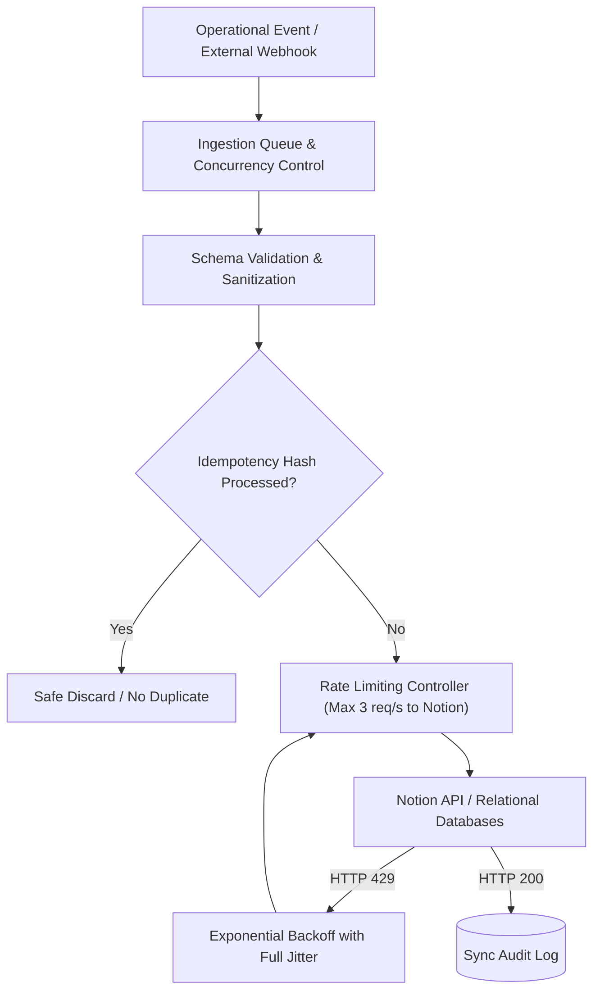

  <a class="action-btn btn-code" href="https://github.com/LuzuJ" target="_blank" rel="noopener">View GitHub Profile</a>

## 1. Root Problem: Operational Latency and State Desynchronization

In organizations managing concurrent engineering and operational squads, information fragmentation causes systemic friction:
* **Manual Operational Latency:** Handing over technical requirements and progress updates introduces day-long delays between functional dependencies.
* **Split-Brain States:** Non-atomic updates across disjoint tools cause teams to operate against stale specifications.

At **Manticore Labs**, I designed and deployed internal automated pipelines, standardizing operational execution and connecting relational knowledge bases through decoupled event flows.

## 2. Pipeline Architecture with n8n and Notion API

### 2.1. Mitigating Notion API Rate Limits (HTTP 429)
The Notion API enforces strict burst limits (averaging 3 requests/second). To prevent cascading failures:
* **Token Bucket Traffic Shaping:** n8n workflows incorporate smoothing buffers to throttle outbound writes.
* **Exponential Backoff with Full Jitter:** When receiving `429 Too Many Requests`, pipelines compute backoff delays dynamically:
$$t_{\text{wait}} = \min(t_{\max}, t_{\text{base}} \cdot 2^{\text{retry}}) + \text{random}(0, \text{jitter})$$

### 2.2. Idempotency & Cycle Prevention
For bidirectional workflows, preventing infinite feedback loops is paramount. The pipeline evaluates a SHA-256 digest of payload fields; if the hash matches the last persisted state, the pipeline terminates execution with zero mutations, eliminating duplicate API calls.
