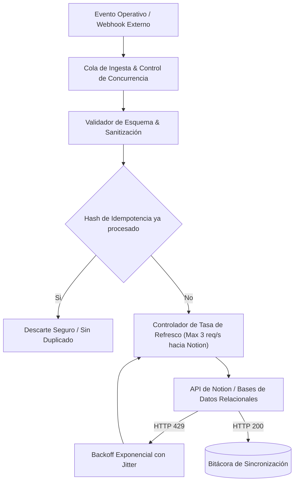

  <a class="action-btn btn-code" href="https://github.com/LuzuJ" target="_blank" rel="noopener">Ver Perfil GitHub</a>

## 1. Problema Raíz: Fricción Operativa y Desincronización de Estados

En organizaciones con múltiples células de trabajo concurrentes, la fragmentación de la información engendra cuellos de botella severos:
* **Latencia Operativa Humana:** La transferencia manual de requisitos, estados de tareas y métricas de rendimiento introduce retrasos de horas o días entre dependencias funcionales.
* **Inconsistencia de Estados:** La actualización no atómica de múltiples herramientas genera estados partidos donde el equipo técnico opera sobre especificaciones desactualizadas.

En **Manticore Labs**, diseñé y desplegué la arquitectura de automatización de procesos internos, estandarizando la gestión operativa e integrando las bases de datos de conocimiento mediante pipelines desacoplados.

## 2. Arquitectura de Pipelines con n8n y Notion API

### 2.1. Mitigación del Rate Limiting de Notion (HTTP 429)
La API de Notion impone límites estrictos de consumo (promedio de 3 peticiones por segundo). Para evitar caídas en cascada durante ráfagas de sincronización:
* **Ventana Deslizante con Token Bucket:** Los flujos en n8n incorporan nodos intermediarios que amortiguan las peticiones salientes.
* **Reintentos con Backoff Exponencial y Jitter:** Cuando se recibe un código `429 Too Many Requests`, el workflow suspende el reenvío calculando una espera:
$$t_{\text{wait}} = \min(t_{\max}, t_{\text{base}} \cdot 2^{\text{reintento}}) + \text{random}(0, \text{jitter})$$

### 2.2. Control de Idempotencia y Prevención de Ciclos
Para flujos bidireccionales, el mayor riesgo es el disparo de bucles infinitos de actualización. La pipeline calcula un hash SHA-256 de los campos modificados del registro; si el hash entrante coincide con el último estado persistido en la base de control, el evento se descarta en tiempo cero, previniendo loops y sobrecostes de API.
