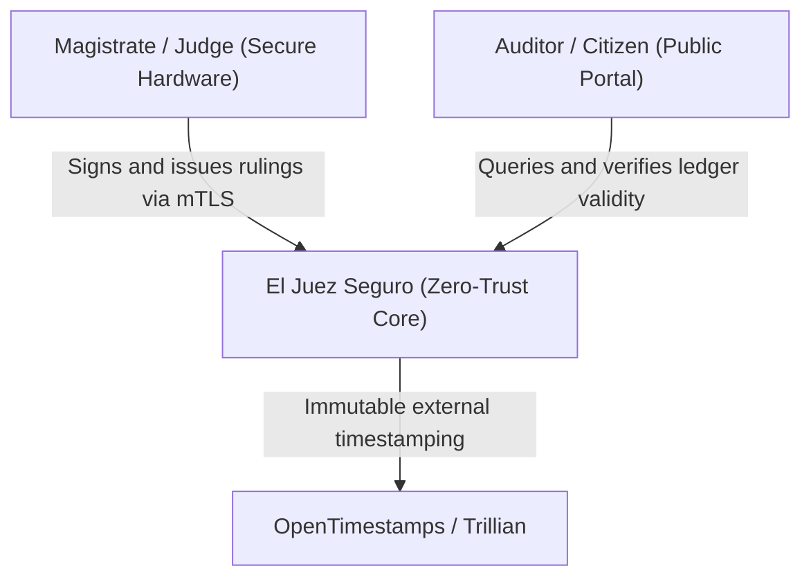
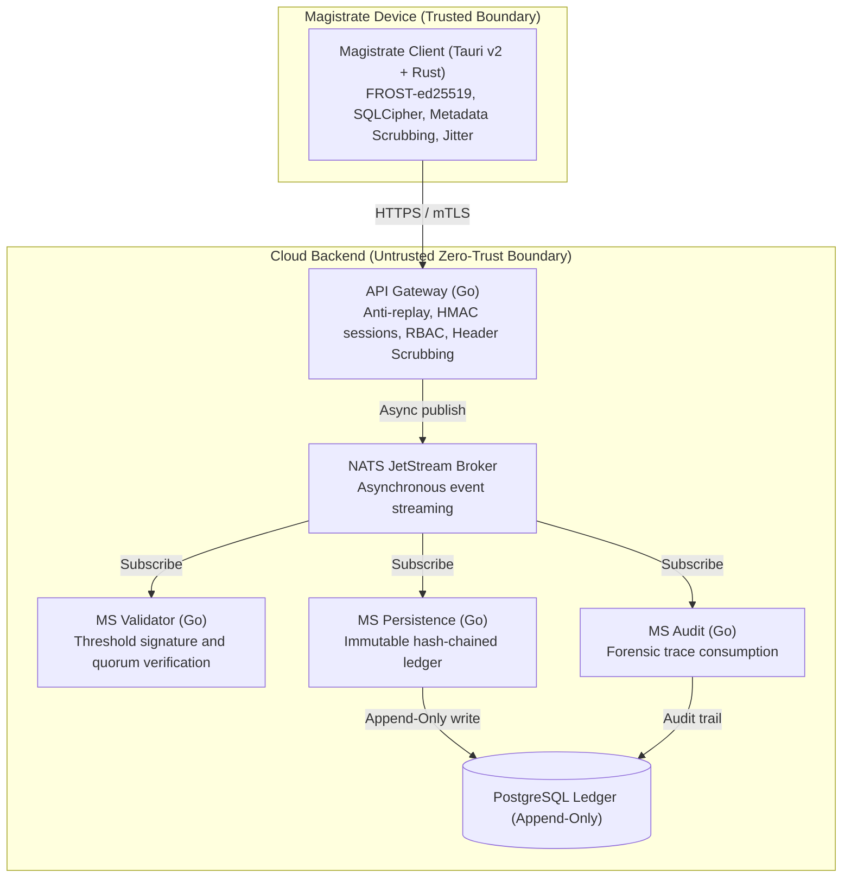

  <a class="action-btn btn-code" href="https://github.com/LynxCores/Juez-Seguro.git" target="_blank" rel="noopener">View Code (GitHub)</a>
  <a class="action-btn btn-doc" href="/docs/ECC_DSE_Certificate.pdf" target="_blank">DevSecOps Certification (PDF)</a>

## 1. Problem Space & Threat Model

In high-risk judicial jurisdictions, issuing rulings exposes magistrates to physical violence, extortion, and bribery. Legacy centralized judicial systems suffer from three critical vulnerabilities:
1. **Direct Issuer Traceability:** Standard nominal digital signatures (e.g., X.509) irrevocably bind the signer's identity to the ruling, visible to database administrators and network adversaries.
2. **Infrastructure Trust Dependency:** A rogue database admin or attacker with privileged server access can modify or suppress judicial records retroactively without leaving a cryptographic audit trail.
3. **Metadata Leakage:** Even with payload encryption, network traffic analysis (source IP, exact timestamps, packet bursts) permits statistical correlation of the magistrate's physical identity.

## 2. Fundamental Architectural Decisions

To solve these constraints without single points of compromise, **El Juez Seguro** is architected under strict **Zero-Trust** principles:

### Split Plane: Rust (Client) vs. Go (Backend Services)
* **Magistrate Client (Tauri v2 + Rust):** The magistrate's physical hardware is the sole trusted boundary. Cryptographic threshold signing (FROST-ed25519) runs natively in Rust with immediate memory zeroization of private key material. It integrates a local SQLite Outbox encrypted with SQLCipher and deterministic timing jitter to break temporal traffic correlation.
* **Go Distributed Microservices:** Go was selected for backend services due to lightweight concurrency (goroutines), minimal memory footprint per open TCP socket, and static single-binary compilation enabling minimal distroless container images.

### Asynchronous Messaging via NATS JetStream
Communication between the API gateway and backend worker microservices is decoupled via **NATS JetStream**:
* **Mitigating Head-of-Line Blocking:** Incoming HTTP requests receive an immediate `202 Accepted` after token parsing, offloading heavy cryptographic verification (`ms-validador`) and ledger persistence (`ms-persistencia`) to the event broker.
* **Burst & Failure Tolerance:** Even under database spikes or temporary latency, events persist in NATS streams with at-least-once semantics, preventing cascading failures.

---

## 3. C4 Architecture Model

### Level 1 — System Context Diagram (C4-L1)

### Level 2 — Container Diagram (C4-L2)

### Level 3 — API Gateway Component Diagram (C4-L3)

---

## 4. Security Auditing & DevSecOps Implementation

In alignment with **DevSecOps Essentials (DSE)** industry standards:
1. **Static Analysis (SAST):** Automated `gosec` and `cargo clippy` scanning in CI pipelines to prevent memory leaks and insecure randomness.
2. **Secret Leak Prevention:** Strict `.gitleaks.toml` rules blocking commits with high-entropy keys or test certificates.
3. **Network Isolation:** Hardened reverse proxy configuration with Caddy for TLS termination and DoS mitigation.
