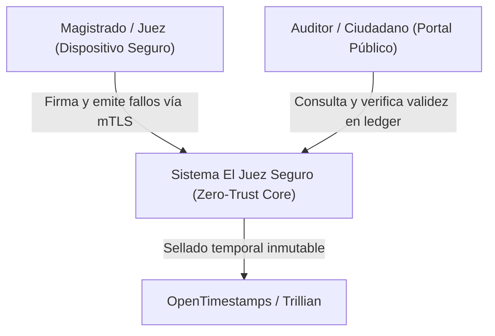
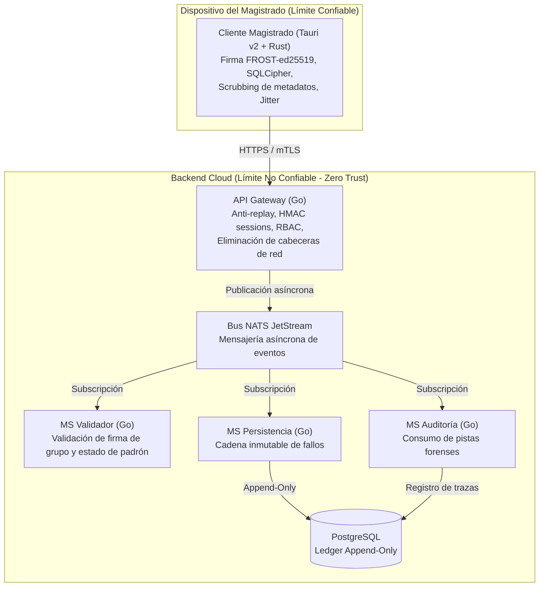
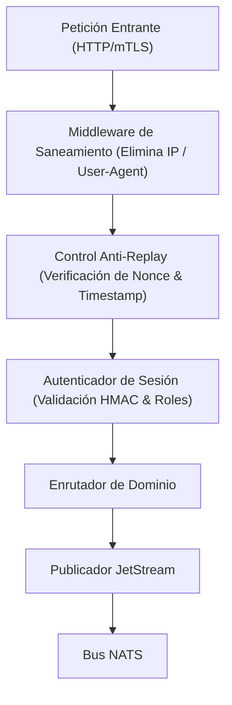

<div class="action-links">
  <a class="action-btn btn-code" href="https://github.com/LynxCores/Juez-Seguro.git" target="_blank" rel="noopener">Ver Código (GitHub)</a>
  <a class="action-btn btn-doc" href="/docs/ECC_DSE_Certificate.pdf" target="_blank">Certificación DevSecOps</a>
</div>

## 1. Planteamiento del Problema y Espacio de Amenazas

En jurisdicciones de alto riesgo procesal, la emisión de fallos judiciales expone a los magistrados a coacciones físicas, represalias y sobornos. Los sistemas judiciales centralizados tradicionales sufren de tres vulnerabilidades estructurales críticas:
1. **Trazabilidad directa del emisor:** La firma digital estándar (ej. X.509 o clave pública nominal) vincula inequívocamente al firmante con la sentencia ante cualquier operador de base de datos o atacante con acceso a la red.
2. **Dependencia de confianza en la infraestructura:** Un administrador de base de datos o un atacante con acceso privilegiado al servidor puede alterar o suprimir fallos con posterioridad a su emisión sin dejar rastro inmutable.
3. **Fuga de metadatos:** Incluso si el contenido está cifrado, el análisis de tráfico (dirección IP de origen, timestamps exactos, patrones de ráfagas) permite correlacionar la identidad del juez emisor.

## 2. Decisiones Arquitectónicas Fundamentales

Para resolver estos desafíos sin introducir puntos únicos de compromiso, la arquitectura de **El Juez Seguro** se fundamenta en principios estrictos de **Zero-Trust**:

### Separación de Planos: Rust (Cliente) vs. Go (Servicios Backend)
* **Cliente Magistrado (Tauri v2 + Rust):** La máquina del magistrado se asume como el único entorno confiable. El cálculo criptográfico de firma de umbral (FROST-ed25519) se ejecuta nativamente en Rust, garantizando la purga inmediata de memoria de claves privadas tras la firma (*zeroization*). Incorpora un patrón *Outbox* local en SQLite cifrado con SQLCipher y adición de *jitter* temporal determinista para romper correlaciones temporales de tráfico.
* **Microservicios en Go:** Go fue seleccionado para el backend distribuido debido a su modelo de concurrencia nativo (goroutines), bajo consumo de memoria por socket TCP, compilación estática que simplifica la creación de contenedores *distroless* y estricto tipado estático para auditoría de código.

### Paso de Mensajes Asíncrono con NATS JetStream
La comunicación entre la puerta de enlace (`gateway`) y los procesadores backend está desacoplada mediante **NATS JetStream**:
* **Mitigación de Head-of-Line Blocking:** Las peticiones HTTP entrantes reciben un acuse de recibo inmediato (`202 Accepted`) tras la validación de tokens y saneamiento sintáctico, delegando la verificación criptográfica y el almacenamiento al bus de eventos.
* **Tolerancia a Picos y Fallos:** Si el clúster de base de datos o el validador experimentan latencia, los mensajes persisten en los streams de NATS con semántica *at-least-once*, evitando caídas en cascada.

```
[ Cliente Tauri (Rust) ] 
       │ (HTTPS / mTLS + Jitter)
       ▼
[ API Gateway (Go) ] ────▶ (Publica evento: fallo.ingresado)
       │                              │
       ▼ (NATS JetStream)             ▼ (NATS JetStream)
[ MS Validador (Go) ]           [ MS Persistencia (Go) ]
(Verifica Firma de Umbral)      (Ledger Append-Only en PostgreSQL)
       │                              │
       └──────────────┬───────────────┘
                      ▼
            [ MS Auditoría (Go) ]
```

### Ledger Inmutable en PostgreSQL
La persistencia de fallos no utiliza tablas mutables estándar:
* **Cadena de Hashes Criptográficos:** Cada registro almacena `hash_anterior` y `hash_actual = SHA-256(payload || hash_anterior || firma_grupo)`.
* **Inmutabilidad a Nivel de Motor:** Reglas de base de datos y triggers impiden `UPDATE` y `DELETE`, convirtiendo a la tabla en una secuencia estrictamente secuencial y auditable públicamente.

---

## 3. Modelo de Arquitectura C4

### Nivel 1 — Diagrama de Contexto del Sistema (C4-L1)



### Nivel 2 — Diagrama de Contenedores (C4-L2)



### Nivel 3 — Diagrama de Componentes del API Gateway (C4-L3)



---

## 4. Auditoría de Seguridad y Prácticas DevSecOps

En cumplimiento con el estándar de desarrollo seguro y la certificación **DevSecOps Essentials (DSE)**:
1. **Detección Estática de Vulnerabilidades:** Integración de `gosec` en pipelines CI/CD de Azure DevOps para auditar desbordamientos de memoria, manejo inseguro de números aleatorios y llamadas al sistema.
2. **Prevención de Fuga de Credenciales:** Reglas estrictas en `.gitleaks.toml` bloqueando commits que contengan llaves criptográficas o certificados de prueba.
3. **Aislamiento de Red:** Políticas estrictas de red y proxy reverso con Caddy para terminación TLS y protección contra denegación de servicio (DoS).
